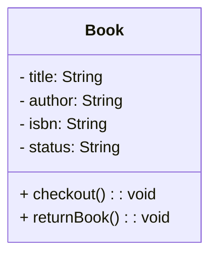
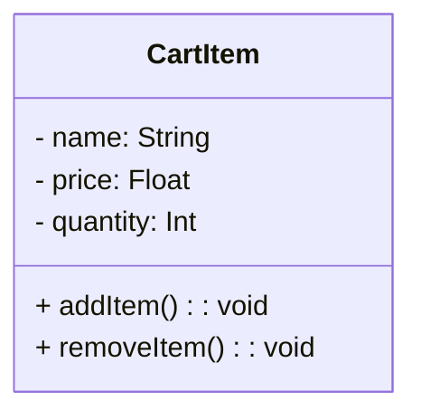
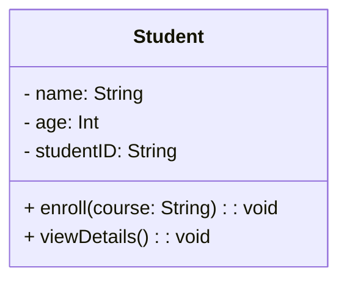
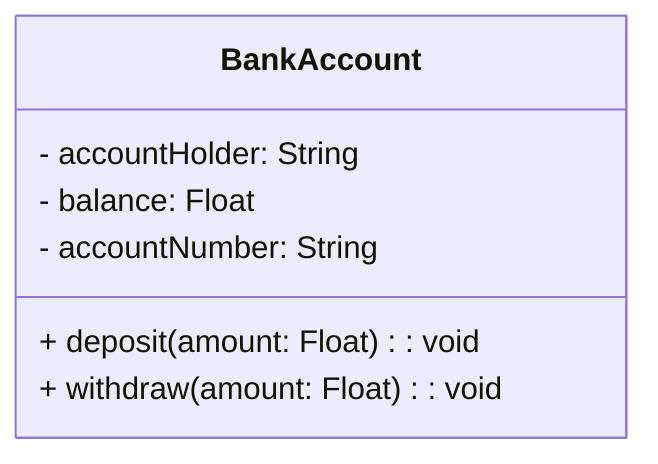
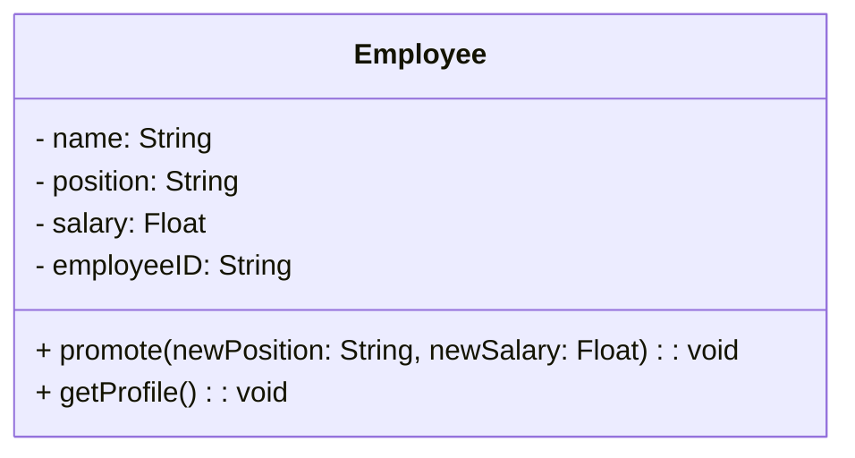

# Understanding the Concept of a Class in Object-Oriented Programming (OOP)

## What is a Class?

A **class** is a blueprint or template for creating objects in Object-Oriented Programming (OOP). Think of a class as a design or plan that defines the properties (data) and behaviors (methods) that an object of that class will have.

### Why Does a Class Matter?

1. **Reusability**: Classes allow us to reuse the same structure for creating multiple objects.
2. **Organization**: They help organize code by grouping related data and behavior together.
3. **Scalability**: Classes make it easier to scale applications by managing objects systematically.

---

## Detailed Examples with Mermaid Diagrams

### Example 1: Library Book System

#### Requirements:
A library system manages books. Each book has a title, author, ISBN number, and status (available or checked out). It also has behaviors such as checking out and returning a book.

#### Identifying Classes:
- **Class Name**: `Book`
- **Properties**:
  - `title`: The title of the book.
  - `author`: The author of the book.
  - `isbn`: A unique identifier for the book.
  - `status`: Indicates if the book is available or checked out.
- **Methods**:
  - `checkout()`: Marks the book as checked out.
  - `returnBook()`: Marks the book as available.

#### Explanation:
The `Book` class encapsulates all the data and behavior needed to manage a single book in the library system.

---

### Example 2: Online Shopping Cart

#### Requirements:
An online shopping cart contains items. Each item has a name, price, and quantity. Items can be added to or removed from the cart.

#### Identifying Classes:
- **Class Name**: `CartItem`
- **Properties**:
  - `name`: The name of the item.
  - `price`: The price of the item.
  - `quantity`: The number of items.
- **Methods**:
  - `addItem()`: Increases the quantity of the item.
  - `removeItem()`: Decreases the quantity of the item.

#### Explanation:
The `CartItem` class models a single item in the shopping cart, along with the actions that can be performed on it.

---

### Example 3: Student Management System

#### Requirements:
A school system needs to manage student data. Each student has a name, age, and ID number. Students can enroll in courses and view their details.

#### Identifying Classes:
- **Class Name**: `Student`
- **Properties**:
  - `name`: The student’s name.
  - `age`: The student’s age.
  - `studentID`: A unique identifier for the student.
- **Methods**:
  - `enroll(course)`: Adds a course to the student’s record.
  - `viewDetails()`: Displays the student’s details.

#### Explanation:
The `Student` class models a student with their details and the actions they can perform.

---

### Example 4: Banking System

#### Requirements:
A bank manages accounts. Each account has an account holder’s name, balance, and account number. Accounts can perform deposits and withdrawals.

#### Identifying Classes:
- **Class Name**: `BankAccount`
- **Properties**:
  - `accountHolder`: The name of the account holder.
  - `balance`: The amount of money in the account.
  - `accountNumber`: A unique identifier for the account.
- **Methods**:
  - `deposit(amount)`: Increases the account balance.
  - `withdraw(amount)`: Decreases the account balance.

#### Explanation:
The `BankAccount` class encapsulates account details and behaviors, enabling management of transactions.

---

### Example 5: Employee Management System

#### Requirements:
An organization manages employees. Each employee has a name, position, salary, and an ID. Employees can receive a promotion and get details of their profile.

#### Identifying Classes:
- **Class Name**: `Employee`
- **Properties**:
  - `name`: The employee’s name.
  - `position`: The job title of the employee.
  - `salary`: The employee’s salary.
  - `employeeID`: A unique identifier for the employee.
- **Methods**:
  - `promote(newPosition, newSalary)`: Updates the position and salary.
  - `getProfile()`: Displays the employee’s profile details.

#### Explanation:
The `Employee` class models an employee’s profile and the operations related to their career progress.

---

## Summary

A class is a foundational concept in OOP that helps structure code by bundling data and behavior into a single unit. In this lesson, we’ve seen how classes can be used to represent real-world entities like books, shopping cart items, students, bank accounts, and employees. By defining properties and methods, classes make systems easier to understand, scale, and maintain.

Use the provided Mermaid diagrams to visualize these examples and solidify your understanding of how classes work!