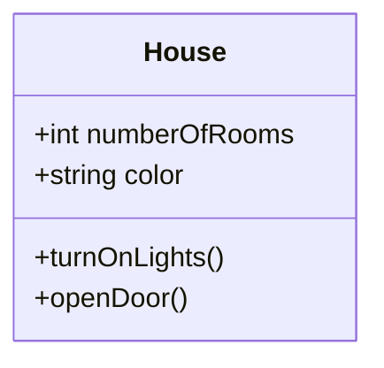
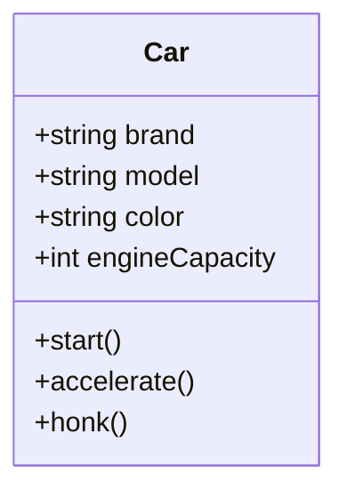

# **Understanding the Concept of a Class and Object in OOP**

---

## **What is a Class?**

A **class** is the foundational building block of Object-Oriented Programming (OOP). It is a blueprint or template that defines the properties (data) and behaviors (methods) that objects created from the class will have.  

Think of a class as a **plan** or **recipe** for creating specific items or instances, called **objects**.

---

### **Components of a Class**
1. **Attributes**: These are the properties or data members of the class. They define what data each object will store.  
   Example: A car’s color, brand, and engine size.
2. **Methods**: These are the actions or functions that objects of the class can perform.  
   Example: A car can start, accelerate, or honk.

---

## **What is an Object?**
An **object** is an instance of a class. When a class is created, it is just a template—it doesn't hold any actual data. You use the class to create objects that represent specific entities with real values.  

For example, from the class **Car**, you can create objects like:  
- A red Toyota Corolla with a 1.8L engine.  
- A blue Ford Mustang with a 5.0L engine.  

Each object has **specific attribute values** while still sharing the same structure and behavior defined in the class.

---

## **Class vs. Object**  

| **Aspect**          | **Class**                               | **Object**                              |
|----------------------|-----------------------------------------|-----------------------------------------|
| **Definition**       | A template or blueprint for creating objects. | An instance of a class with specific data. |
| **Purpose**          | Defines the structure and behavior of objects. | Represents a real-world entity or instance. |
| **Example**          | A `Car` class defines attributes like `brand` and `color` and methods like `start()`. | A red Toyota Corolla (specific data for a car). |

---

### **Real-Life Example: House**
A **class** is like an architectural blueprint for a house.  
- The blueprint itself is not a house, but it describes the structure (rooms, doors, windows) and functionality (open doors, turn on lights).  
- Once you have a blueprint, you can build multiple houses (**objects**) with varying designs.

---

## **Class and Object Examples**

### **Example 1: House Class**
**Class Diagram:**  

**Objects Derived from the Class:**

| **Object Name**     | **Attributes**          | **Methods**       |
|----------------------|-------------------------|-------------------|
| House 1              | Rooms: 4, Color: Blue  | turnOnLights(), openDoor() |
| House 2              | Rooms: 3, Color: White | turnOnLights(), openDoor() |

---

### **Example 2: Car Class**
**Class Definition:**  

**Objects Derived from the Class:**

| **Object Name**     | **Attributes**                                   |
|----------------------|-------------------------------------------------|
| Toyota Corolla       | Brand: Toyota, Model: Corolla, Color: Red, Engine Capacity: 1.8L |
| Ford Mustang         | Brand: Ford, Model: Mustang, Color: Blue, Engine Capacity: 5.0L |

---

### **More Detailed Explanation of Objects**
1. **Attributes with Specific Values**:  
   Objects hold real-world data. For example:  
   - The `Toyota Corolla` object has the `brand` "Toyota," `model` "Corolla," and `color` "Red."
   - The `Ford Mustang` object has the `brand` "Ford," `model` "Mustang," and `color` "Blue."

2. **Behavior (Methods)**:  
   Each object can perform the actions defined in the class. For example:  
   - A car object can `start()` or `accelerate()`.  
   - A house object can `openDoor()` or `turnOnLights()`.

---

## **How to Represent Objects in Markdown**

Objects can be represented in a **table format** to clearly define their attributes and methods:

**Example: Car Objects**

| **Object**          | **Brand** | **Model**     | **Color** | **Engine Capacity** | **Actions (Methods)** |
|----------------------|-----------|---------------|-----------|----------------------|------------------------|
| Toyota Corolla       | Toyota    | Corolla       | Red       | 1.8L                | start(), accelerate()  |
| Ford Mustang         | Ford      | Mustang       | Blue      | 5.0L                | start(), honk()        |

---

## **Exercises**

### **Exercise 1: Understand the House Class**
Given the class diagram below, create two objects representing houses with the following details:
- **House 1**: 3 rooms, yellow color.  
- **House 2**: 5 rooms, white color.  

Fill in the table:

| **Object Name** | **Number of Rooms** | **Color** | **Methods**         |
|------------------|---------------------|-----------|---------------------|
| House 1          |                     |           | turnOnLights(), openDoor() |
| House 2          |                     |           | turnOnLights(), openDoor() |

---

### **Exercise 2: Create a New Class**
Design a class for a `Book` with the following:  
1. Attributes:  
   - `title` (string)  
   - `author` (string)  
   - `numberOfPages` (integer)  

2. Methods:  
   - `readPage()` (marks one page as read).  

Draw a class diagram and create two objects for the class with specific attribute values.