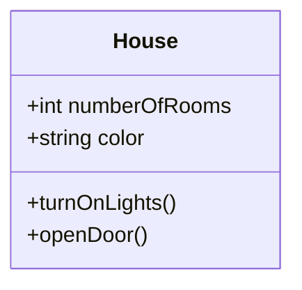
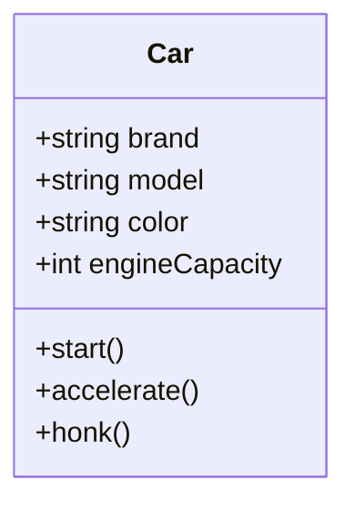

You're absolutely right! Mermaid's class diagram syntax does not support representing objects directly (as instances of a class with specific values for attributes). Instead, it is designed for modeling **class structures** with attributes and methods. To represent objects, we need to describe their attributes and values in a textual or tabular format outside of the Mermaid diagram.

Here’s an updated Markdown version without the incorrect object syntax:

---

## Understanding the Concept of a Class in OOP

### What is a Class?  
A **class** in OOP is a **blueprint** or **template** for creating objects. It defines:  
1. **Attributes (properties)**: The data that an object will have.  
2. **Methods (behaviors)**: The actions or functions an object can perform.  

Think of a class as a recipe, a design, or a plan that outlines the structure and behavior of objects.

---

### Real-Life Examples of Classes

#### Example 1: Blueprint for a House  
- A **class** is like the blueprint for a house.  
- The blueprint describes attributes like the number of rooms, size, and layout, as well as actions like opening doors or turning on lights.  

#### Representing a House Class in Mermaid

#### Example 2: Class as a Car Template  
- **Class**: The design of a car.  
- **Attributes**: Brand, model, color, engine capacity.  
- **Methods**: Start the car, stop the car, accelerate, honk.

#### Representing a Car Class in Mermaid

---

### Example Objects

While Mermaid doesn’t support directly modeling objects, we can describe objects using a simple table:

| **Object**       | **Attributes**             |
|-------------------|----------------------------|
| Toyota Corolla    | Brand: Toyota, Model: Corolla, Color: Red, Engine: 1.8L |
| Ford Mustang      | Brand: Ford, Model: Mustang, Color: Blue, Engine: 5.0L |

---

### Key Points to Remember  
1. A **class** is a template, not an object itself.  
2. You can create multiple **objects** from a class, each with unique attribute values.  
3. Attributes and methods define the **data** and **behavior** of objects.  

---

Let me know if you'd like further adjustments or more examples!